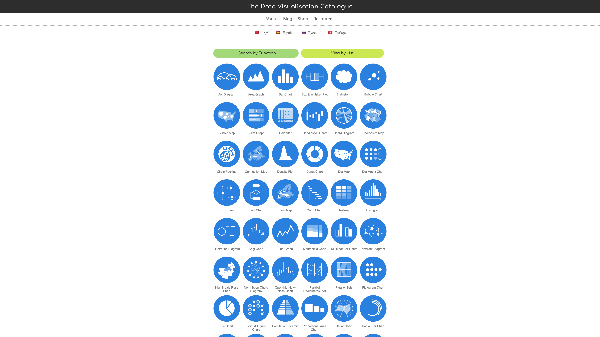

# Week 1: Zachte en harde datavisualisaties

# Hoorcollege 1 september

## Yordi Dam

Met datavisualisatie kan je verhalen vertellen die met tekst moeilijk te vertellen zijn.
Yordi doet dit in Localfocus; een datavisualisatietool gemaakt door Yordi en zijn vrienden.

### extragratistips

1. Stel 1 goede vraag om je data te kunnen visualiseren. Zorg ervoor dat deze erg gericht is. Less = more.
2. Denk aan je publiek. Complexe of artistieke visuals maken kan uiteraard wel, maar niet voor een algemeen publiek.
3. Plain & Simple kaartendata is het best.
4. Noem niet teveel getallen in de tekst, rond ze af of maak ze menselijk.
5. Zoek naar de juiste verhouding tussen eye-candy en brain-candy. Wat is noodzakelijk en wat is mooi/illustratief.

Waarom visualiseren?

- Patronen, trends en uitschieters worden zichtbaar
- Het helpt bij het analyseren van data
- Met een visualisatie krijg je een veel beter beeld over wat de data je vertelt, en wat jij met de data kan vertellen.

De Y-as afbreken is 99% van de tijd niet nodig, dus niet doen als het niet nodig is.

Breidt je visuele vocabulaire uit door veel visuals te bekijken en te analyseren. Welke designafwegingen zijn gemaakt en waarom?

Nog wat referenties van Yordi

> https://www.datavizcatalogue.com

> Financial Times visual vocabulary
