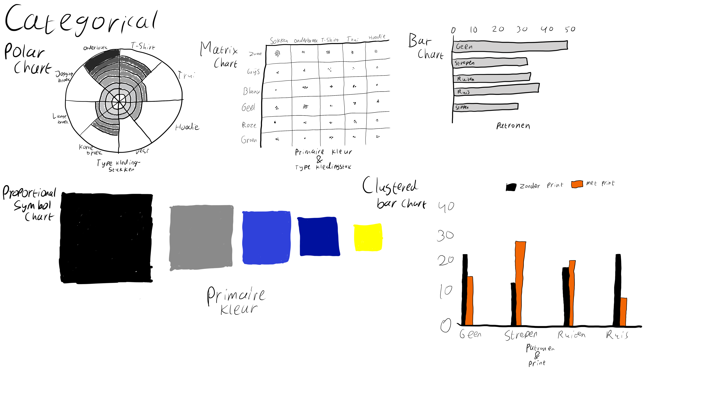
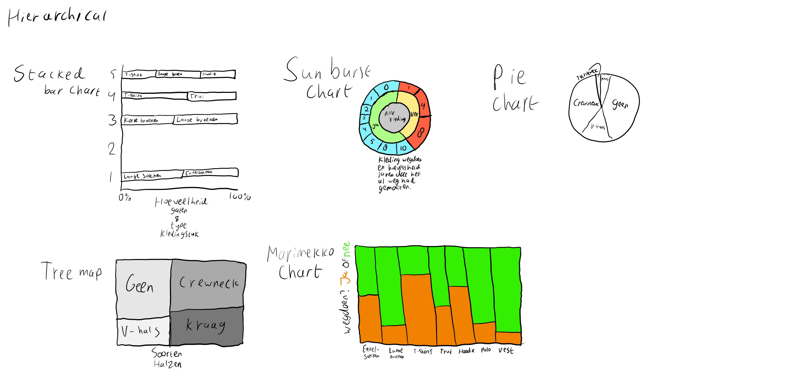
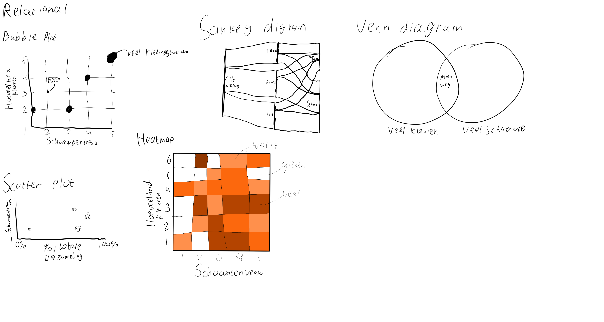
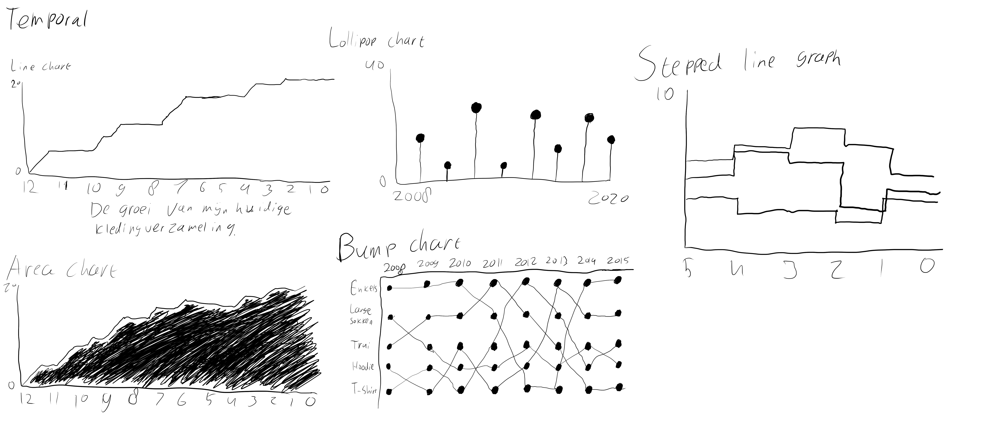
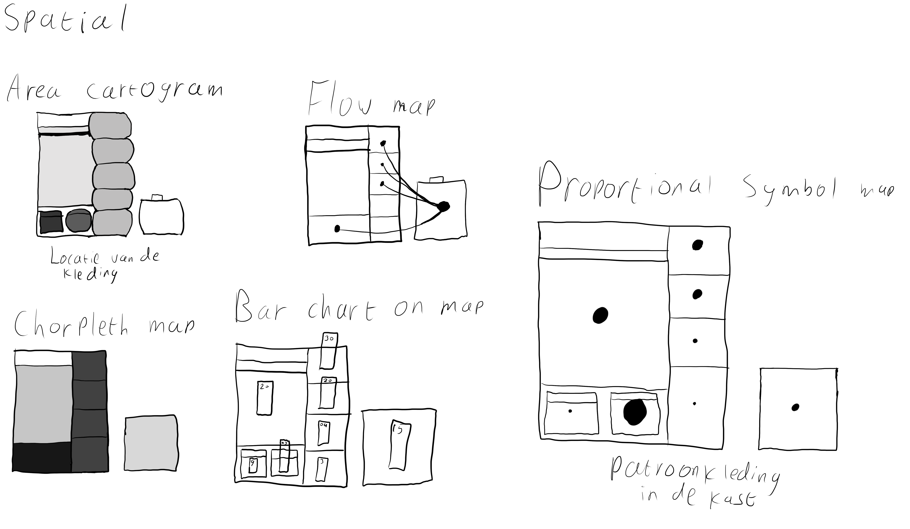

# CHRTS

CHRTS: Categorical, Hierarchical, Relational, Temporal en Spatial. 5 categorieën voor grafieken en diagrammen die ik allemaal heb onderzocht.

## Categorical

Voor Categorical heb ik vooral gekeken naar hoe verschillende variabelen goed weer te geven zijn in grafieken. De variabelen die ik zou willen gebruiken categoriseren de collectie van zichzelf, dus heb ik voornamelijk zitten kijken naar manieren om dat het beste uit de verf te laten komen. Ik vind de proportional symbol chart wel erg leuk, voornamelijk met "primaire kleur" als variabel. Dit heb ik dus hieronder uitgewerkt.

> Uitwerking komt nog

## Hierarchical

Ik heb bij hierarchical geprobeerd hiërarchische verbanden te vinden in mijn data. Dat was nogal lastig, aangezien er niet heel veel hiërarchie in mijn data zit. Toch heb ik een verhouding en grafiek gevonden die ik graag uit wilde werken, namelijk de Stacked Bar chart met als variabelen de type kledingstukken per hoeveelheid gaten.

> Uitwerking komt nog

## Relational

Voor de relational grafieken heb ik gekeken hoe ik relaties tussen variabelen het beste naar voren kan halen. De Sankey diagram lijkt mij hiervoor de beste keuze. Het is een lastige diagram om uit te werken, maar omdat het zo flexibel is kan ik veel variabelen erin verwerken om zo relaties tussen die variabelen naar voren te halen. De variabelen die ik kies zijn: type kledingstuk, kledingmaat, type hals en staut schoonheid.

> Uitwerking komt nog

## Temporal

Bij temporal wilde ik kijken hoe ik de groei van de huidige inhoud van mijn kledingcollectie over de jaren heen het beste kon weergeven. Daarbij vind ik de lollipop chart het leukst. Het is overzichtelijk, simpel en toch wel speels. De variabelen die ik erin heb verwerkt is het aantal jaren dat ik de kleding al in bezit heb. Zo kan ik achterhalen wanneer de kledingstukken in huis gehaald zijn.

> Uitwerking komt nog

## Spatial

Bij de spatial grafieken heb ik geëxperimenteerd met hoe ik op verschillende manieren de locatie, maar ook de hoeveelheid kledingstukken op een locatie kan laten zien. Ik vond sommige uitwerkingen vrij onoverzichtelijk, zoals de Area Cartogram. Ik vind de Proportional Symbol Map uiteindelijk het overzichtelijkst, en heb die dan ook verder uitgewerkt.

> Uitwerking komt nog

