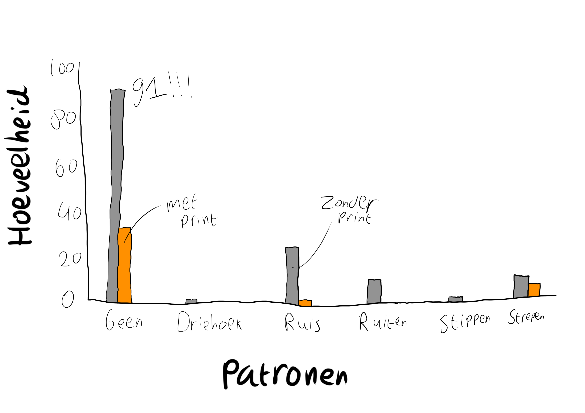
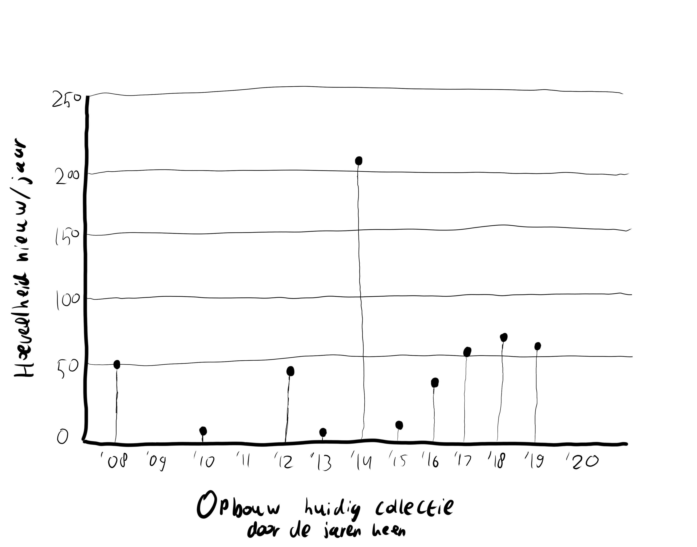

# CHRTS

CHRTS: Categorical, Hierarchical, Relational, Temporal en Spatial. 5 categorieën voor grafieken en diagrammen die ik allemaal heb onderzocht.

## Categorical

Voor Categorical heb ik vooral gekeken naar hoe verschillende variabelen goed weer te geven zijn in grafieken. De variabelen die ik zou willen gebruiken categoriseren de collectie van zichzelf, dus heb ik voornamelijk zitten kijken naar manieren om dat het beste uit de verf te laten komen. Ik wil graag uitvogelen of er een correlatie is tussen de patronen en print variabelen, dus die heb ik in een clustered bar chart uitgewerkt. Die vond ik daar uitermate geschikt voor.

## Hierarchical

Ik heb bij hierarchical geprobeerd hiërarchische verbanden te vinden in mijn data. Dat was nogal lastig, aangezien er niet heel veel hiërarchie in mijn data zit. Toch heb ik een verhouding en grafiek gevonden die ik graag uit wilde werken, namelijk de Stacked Bar chart met als variabelen de type kledingstukken per hoeveelheid gaten.

## Relational

Voor de relational grafieken heb ik gekeken hoe ik relaties tussen variabelen het beste naar voren kan halen. De heatmap biedt een overzichtelijke, duideiljke en rustige verspreiding van data tussen twee variabelen. Ik heb het schaamteniveau en de hoeveelheid kleuren hierin verwerkt. Blijkt toch dat ik van simpele kledingstukken hou.

## Temporal

Bij temporal wilde ik kijken hoe ik de groei van de huidige inhoud van mijn kledingcollectie over de jaren heen het beste kon weergeven. Daarbij vind ik de lollipop chart het leukst. Het is overzichtelijk, simpel en toch wel speels. De variabelen die ik erin heb verwerkt is het aantal jaren dat ik de kleding al in bezit heb. Zo kan ik achterhalen wanneer de kledingstukken in huis gehaald zijn.

## Spatial

Bij de spatial grafieken heb ik geëxperimenteerd met hoe ik op verschillende manieren de locatie, maar ook de hoeveelheid kledingstukken op een locatie kan laten zien. Ik vond sommige uitwerkingen vrij onoverzichtelijk, zoals de Area Cartogram. Ik vind de Proportional Symbol Map uiteindelijk het overzichtelijkst, en heb die dan ook verder uitgewerkt.

