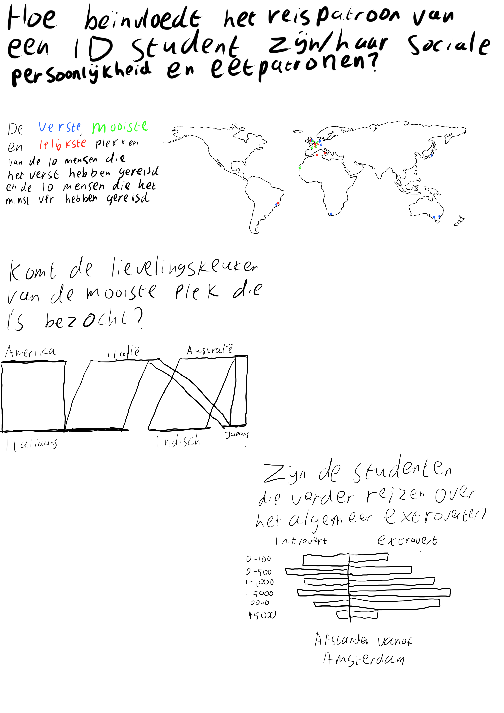
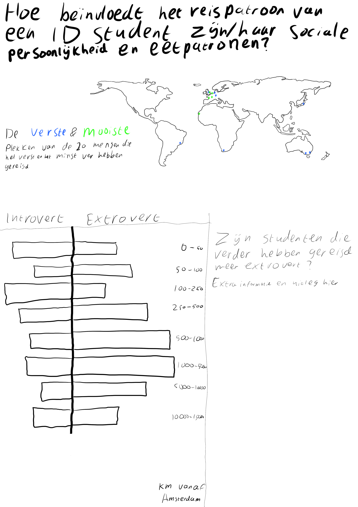

# Editorial Thinking

## Invalshoeken

* Locaties

## Locaties

### Mogelijke hoofdvragen

* Zijn de mensen die verder reizen ook buiten Nederland geboren?
* Reizen ongelukkigere mensen verder naar mooiere plekken?
* Reizen mensen met een auto minder ver dan mensen zonder auto?
* Beïnvloedt het reispatroon het eetgedrag van de gemiddelde student?
* Ligt de lelijkste plek die iemand heeft bezocht dichtbij de geboorteplaats?
* Is de mooiste plek die iemand heeft bezocht ook de verste plek?

### Uiteindelijke hoofdvraag en deelvragen

Hoofdvraag: Hoe beïnvloedt het reispatroon van een ID student zijn/haar sociale persoonlijkheid en eetpatronen? Deelvragen:

* Welke mooie plekken zijn populair onder de studenten?
* Waar willen ID studenten liever niet naartoe?
* Hoe ver heeft de gemiddelde ID student gereisd, en waar naartoe?
* Beïnvloedt dit reispatroon ook het eetgedrag van de gemiddelde student?
* Zijn de mensen die ver reizen meer of minder extrovert?

### Angle: gebruikte variabelen

* Mooiste plek
* Lelijkste plek
* Verste plek
* Favoriete gerecht
* Lievelingskeuken
* Extrovert of introvert

### Framing

Ik ga mijn frame voornamelijk op de brede slagen leggen. Alles tot in de puntje uitwerken is nagenoeg onmogelijk, dus ga ik mij vooral focussen op patronen. In plaats van steden worden het provincies, regio's of landen. Bij lievelingskeuken hebben sommige mensen meerdere keukens ingevoerd. Daarvan zal ik de eerste optie pakken om het overzichtelijk te houden, er vanuit gaande dat de eerste optie de nummer 1 is.

### Focus

Mijn focus zal liggen op de 10 verste en 10 dichtst bijzijnde bezochte plekken bij de variabel "Verste plek". Ik hoop zo een contrast te kunnen laten zien en mijn onderwerpsvragen op een overzichtelijke manier te beantwoorden. De overige cases worden gelowlight, zodat je ze nog wel kan zien en een totaalbeeld kan vormen.

### Schetsen

Na dit uitgewerkt te hebben, vind ik dat er net iets te veel informatie in deze inforgraphic zit. Dus wil ik de variabelen van de lievelingskeuken en lievelingsgerecht eruit halen en dit ervan maken:

