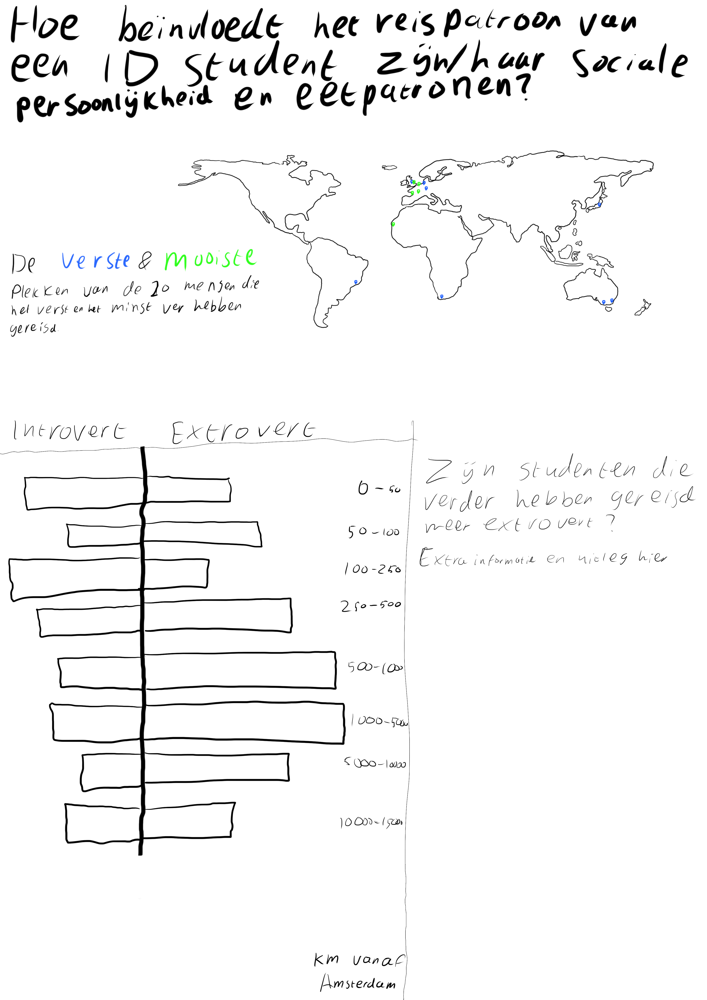
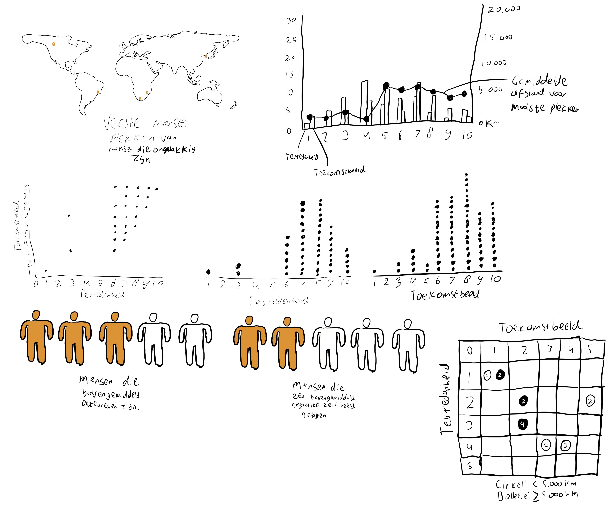
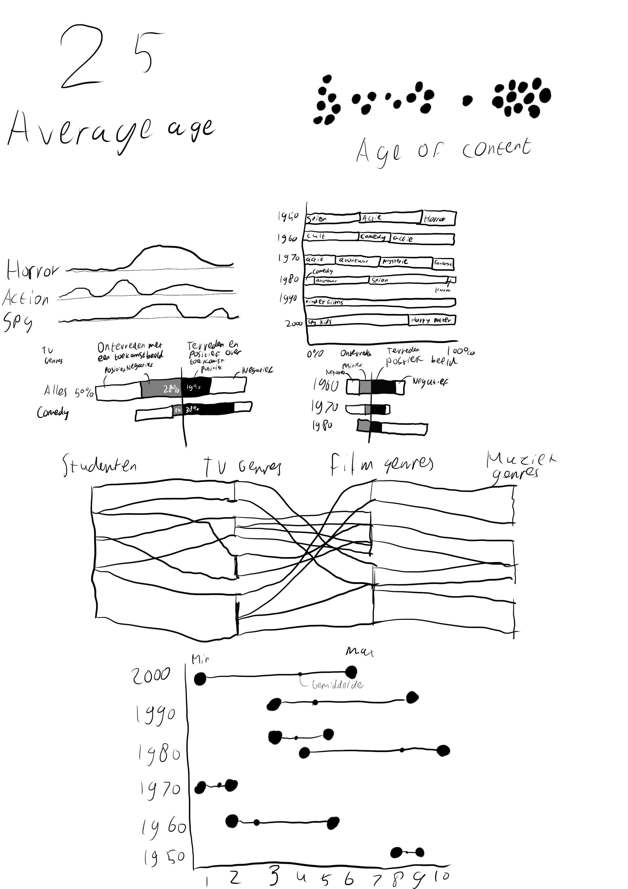

# Editorial Thinking

## Invalshoek 1: Locaties

Hoofdvraag: Hoe beïnvloedt het reispatroon van een ID student zijn/haar sociale persoonlijkheid en eetpatronen? Deelvragen:

* Welke mooie plekken zijn populair onder de studenten?
* Waar willen ID studenten liever niet naartoe?
* Hoe ver heeft de gemiddelde ID student gereisd, en waar naartoe?
* Beïnvloedt dit reispatroon ook het eetgedrag van de gemiddelde student?
* Zijn de mensen die ver reizen meer of minder extrovert?

### Angle: gebruikte variabelen

* Mooiste plek
* Verste plek
* Extrovert of introvert

### Framing

Ik ga mijn frame voornamelijk op de brede slagen leggen. Alles tot in de puntje uitwerken is nagenoeg onmogelijk, dus ga ik mij vooral focussen op patronen. In plaats van steden worden het provincies, regio's of landen. Bij lievelingskeuken hebben sommige mensen meerdere keukens ingevoerd. Daarvan zal ik de eerste optie pakken om het overzichtelijk te houden, er vanuit gaande dat de eerste optie de nummer 1 is.

### Focus

Mijn focus zal liggen op de 10 verste en 10 dichtst bijzijnde bezochte plekken bij de variabel "Verste plek". Ik hoop zo een contrast te kunnen laten zien en mijn onderwerpsvragen op een overzichtelijke manier te beantwoorden. De overige cases worden gelowlight, zodat je ze nog wel kan zien en een totaalbeeld kan vormen.

### Schetsen

### Feedback

Op basis van de feedback die ik van Brit heb gekregen, ben ik erachter gekomen dat je gewoon lekker moet gaan experimenteren met verschillende grafieken, i.p.v. kijken naar de beste uitwerking van een volledige infographic. Daarnaast had Brit ook nog de tip om eerst lekker hoofdvragen te brainstormen, en daarvan de beste te kiezen. De feedback heb ik meegenomen in een nieuwe uitvoering van de variant invalshoek hieronder. Verder had ik nog geen invalshoeken uitgewerkt, dus ga ik met een frisse blik de andere invalshoeken tackelen.

### Brainstormsessie hoofdvragen

* Zijn de mensen die verder reizen ook buiten Nederland geboren?
* Reizen ongelukkigere mensen verder naar mooiere plekken?
* Reizen mensen met een auto minder ver dan mensen zonder auto?
* Beïnvloedt het reispatroon het eetgedrag van de gemiddelde student?
* Ligt de lelijkste plek die iemand heeft bezocht dichtbij de geboorteplaats?
* Is de mooiste plek die iemand heeft bezocht ook de verste plek?

### Uiteindelijek hoofdvraag

Reizen ongelukkigere mensen verder naar mooiere plekken?

#### Deelvragen

* Wat is de afstand vanaf Amsterdam naar de mooiste plekken van de studenten?
* Hoe ongelukkig is de gemiddelde student op dit moment?
* Denken de studenten dat hun toekomst slechter of beter zal zijn, vergeleken met hun geluk op dit moment?
* Wat is de verhouding tussen geluk en de afstand tussen Amsterdam en de mooiste plek?
* Reizen mensen met een negatief toekomstbeeld ook ver naar mooie plekken?

### Gebruikte variabelen

* Mooiste plekken
* Tevredenheid over eigen leven
* Positiviteit over toekomst

### Framing

Ik ga de data afkaderen naar de 30 verste plekken vanaf Amsterdam. Ik wil namelijk daarin zien of de tevredenheid een wezenlijke dip neemt naarmate je steeds verder weg gaat, of dat het helemaal niets uitmaakt. Om de 60+ ingevulde locaties daadwerkelijk uit te plotten wordt onoverzichtelijk, en geeft ook geen duidelijk beeld meer. Met 30 resultaten kom je al een redelijk eind.

### Focus

De focus zal op de top 5 uitblinkers liggen. Deze 5 uitblinkers zullen gelijk moeten laten zien of de hoofdvraag met een ja of nee beantwoord kan worden. Die uitblinkers kies ik op basis van hun tevredenheid, en de positiviteit over hun toekomst. Hoe meer ze van de rest ”uitblinken”, hoe sneller ze gekozen worden.

### Angle

## Invalshoek 2: mediaconsumptie

### Brainstormsessie hoofdvragen

- Zijn mensen die aggressievere muziek luisteren boosardiger
- Zijn mensen die een non-fictie boek als favoriet hebben gezonder?
- Zijn mensen die heftige games spelen meer gestresst?
- Zijn mensen die harde muziek luisteren minder gestresst?
- Hoeveel mensen vinden hun telefoon niet hun meest favoriete bezit?
- Wat voor series kijken de information design studenten het meest?
- Hoe oud is de content die de studenten kijken en luisteren?
- Zijn mensen die oudere content kijken en luisteren gelukkiger en minder gestresst?

### Uiteindelijke hoofdvraag

Zijn de studenten die oudere content kijken en luisteren gelukkiger en minder gestresst?

### Deelvragen

- Wat zijn de favoriete films en series, en artiesten van de studenten?
- Onder welke categorieën vallen die films en series?
- Onder welke genres vallen de favoriete artiesten?
- Hoe oud is de content die de studenten kijken en luisteren?
- Zijn mensen die oudere content kijken negatiever over de toekomst?

### Gebruikte variabelen

- Favoriete film
- Favoriete serie
- Favoriete artiest
- Levenstevredenheid
- Stressniveau
- Cijfer toekomstbeeld

### Framing

Ik zal iedereen meenemen in de visualisatie die dit onderzoek heeft ingevuld, inclusief de mensen zonder data. Een totaalplaatje is naar mijn mening hier de beste optie, om een genuanceerd antwoord op mijn hoofdvraag te kunnen krijgen.

### Focus

De focus zal ik leggen op de 3 tot 5 uitblinkers die mijn vraag het beste beantwoorden met een ja of nee. Ik hoop hiermee gelijk met de deur in huis te kunnen vallen.

### Angle

Ik wil de films, series en muzieknummers verdelen over genres, en daarbij ook de gemiddelde leeftijd van die content erin verwerken. Daarnaast wil ik die leeftijd ook samengooien met de levenstevredenheid. Als laatste wil ik het stressniveau en het cijfer voor de toekomstbeeld los van de rest samen zetten, als afsluiter en conclusie.

### Schetsen

## Invalshoek 3: sociaal gedrag

## Invalshoek 4: eten en drinken

## Invalshoek 5: gezondheid
