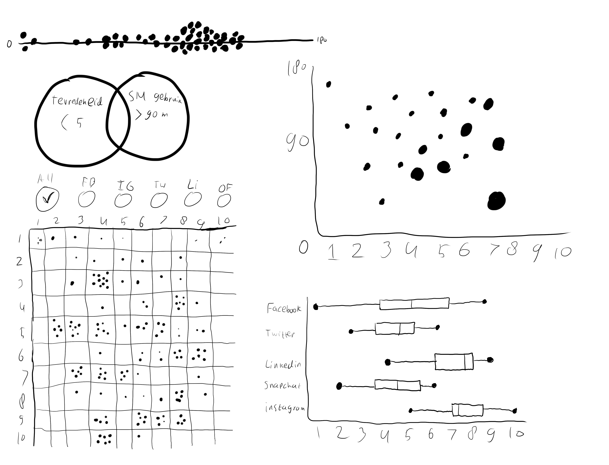
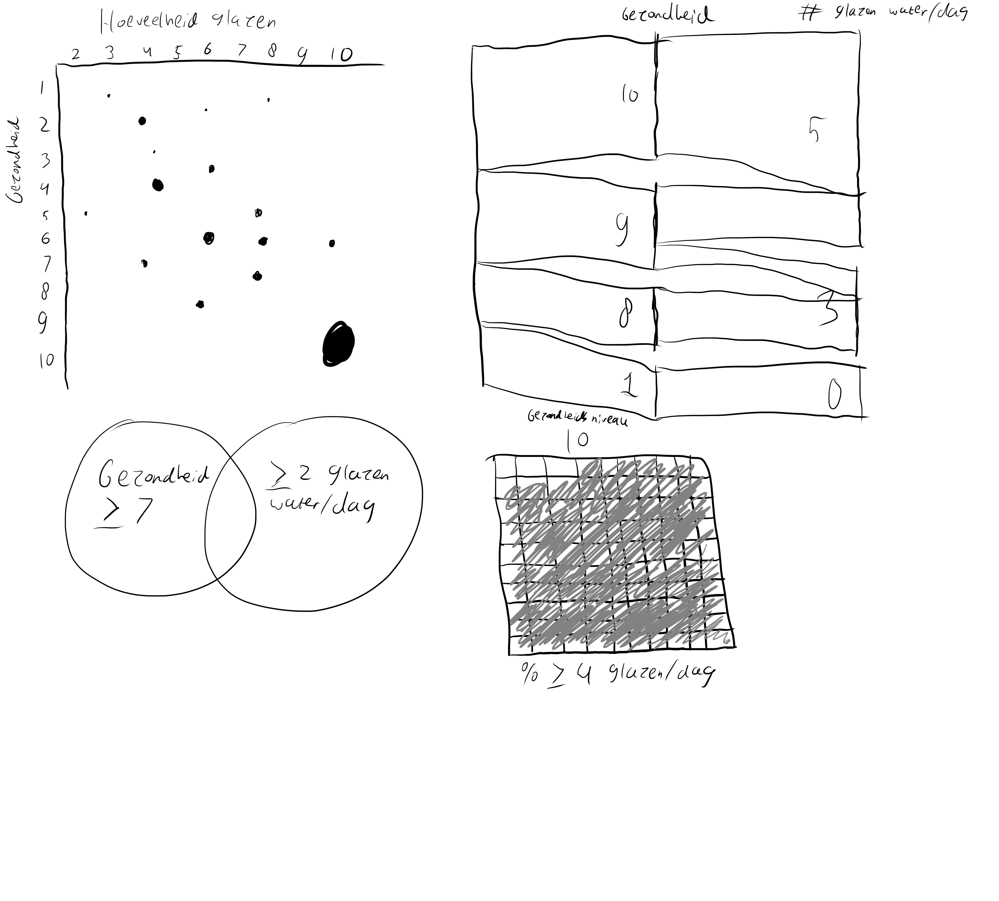
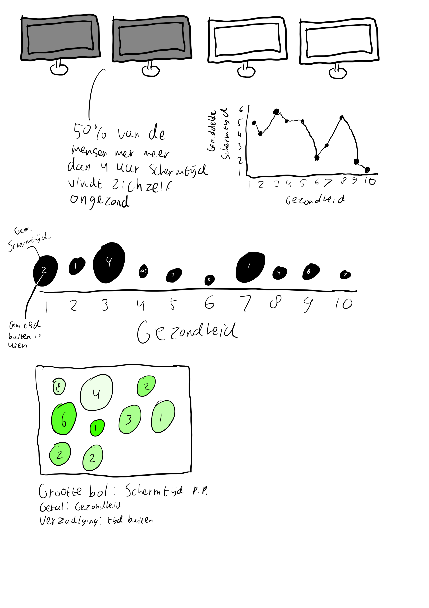

# Editorial Thinking

## Invalshoek 1: Locaties

Hoofdvraag: Hoe beïnvloedt het reispatroon van een ID student zijn/haar sociale persoonlijkheid en eetpatronen? Deelvragen:

* Welke mooie plekken zijn populair onder de studenten?
* Waar willen ID studenten liever niet naartoe?
* Hoe ver heeft de gemiddelde ID student gereisd, en waar naartoe?
* Beïnvloedt dit reispatroon ook het eetgedrag van de gemiddelde student?
* Zijn de mensen die ver reizen meer of minder extrovert?

### Angle: gebruikte variabelen

* Mooiste plek
* Verste plek
* Extrovert of introvert

### Framing

Ik ga mijn frame voornamelijk op de brede slagen leggen. Alles tot in de puntje uitwerken is nagenoeg onmogelijk, dus ga ik mij vooral focussen op patronen. In plaats van steden worden het provincies, regio's of landen. Bij lievelingskeuken hebben sommige mensen meerdere keukens ingevoerd. Daarvan zal ik de eerste optie pakken om het overzichtelijk te houden, er vanuit gaande dat de eerste optie de nummer 1 is.

### Focus

Mijn focus zal liggen op de 10 verste en 10 dichtst bijzijnde bezochte plekken bij de variabel "Verste plek". Ik hoop zo een contrast te kunnen laten zien en mijn onderwerpsvragen op een overzichtelijke manier te beantwoorden. De overige cases worden gelowlight, zodat je ze nog wel kan zien en een totaalbeeld kan vormen.

### Schetsen

### Feedback

Op basis van de feedback die ik van Brit heb gekregen, ben ik erachter gekomen dat je gewoon lekker moet gaan experimenteren met verschillende grafieken, i.p.v. kijken naar de beste uitwerking van een volledige infographic. Daarnaast had Brit ook nog de tip om eerst lekker hoofdvragen te brainstormen, en daarvan de beste te kiezen. De feedback heb ik meegenomen in een nieuwe uitvoering van de variant invalshoek hieronder. Verder had ik nog geen invalshoeken uitgewerkt, dus ga ik met een frisse blik de andere invalshoeken tackelen.

### Brainstormsessie hoofdvragen

* Zijn de mensen die verder reizen ook buiten Nederland geboren?
* Reizen ongelukkigere mensen verder naar mooiere plekken?
* Reizen mensen met een auto minder ver dan mensen zonder auto?
* Beïnvloedt het reispatroon het eetgedrag van de gemiddelde student?
* Ligt de lelijkste plek die iemand heeft bezocht dichtbij de geboorteplaats?
* Is de mooiste plek die iemand heeft bezocht ook de verste plek?

### Uiteindelijek hoofdvraag

Reizen ongelukkigere mensen verder naar mooiere plekken?

#### Deelvragen

* Wat is de afstand vanaf Amsterdam naar de mooiste plekken van de studenten?
* Hoe ongelukkig is de gemiddelde student op dit moment?
* Denken de studenten dat hun toekomst slechter of beter zal zijn, vergeleken met hun geluk op dit moment?
* Wat is de verhouding tussen geluk en de afstand tussen Amsterdam en de mooiste plek?
* Reizen mensen met een negatief toekomstbeeld ook ver naar mooie plekken?

### Gebruikte variabelen

* Mooiste plekken
* Tevredenheid over eigen leven
* Positiviteit over toekomst

### Angle

Ik wil voornamelijk de verbanden tussen tevredenheid en toekomstbeeld samenbrengen door ze tegen elkaar op te zetten. De plekken die het verst zijn voor de mensen die relatief ontevreden zijn laat ik zien op een kaart.

### Framing

Ik ga de data afkaderen naar de 30 verste plekken vanaf Amsterdam. Ik wil namelijk daarin zien of de tevredenheid een wezenlijke dip neemt naarmate je steeds verder weg gaat, of dat het helemaal niets uitmaakt. Om de 60+ ingevulde locaties daadwerkelijk uit te plotten wordt onoverzichtelijk, en geeft ook geen duidelijk beeld meer. Met 30 resultaten kom je al een redelijk eind.

### Focus

De focus zal op de top 5 uitblinkers liggen. Deze 5 uitblinkers zullen gelijk moeten laten zien of de hoofdvraag met een ja of nee beantwoord kan worden. Die uitblinkers kies ik op basis van hun tevredenheid, en de positiviteit over hun toekomst. Hoe meer ze van de rest ”uitblinken”, hoe sneller ze gekozen worden.

### Schetsen

## Invalshoek 2: mediaconsumptie

### Brainstormsessie hoofdvragen

* Zijn mensen die aggressievere muziek luisteren boosardiger
* Zijn mensen die een non-fictie boek als favoriet hebben gezonder?
* Zijn mensen die heftige games spelen meer gestresst?
* Zijn mensen die harde muziek luisteren minder gestresst?
* Hoeveel mensen vinden hun telefoon niet hun meest favoriete bezit?
* Wat voor series kijken de information design studenten het meest?
* Hoe oud is de content die de studenten kijken en luisteren?
* Zijn mensen die oudere content kijken en luisteren gelukkiger en minder gestresst?

### Uiteindelijke hoofdvraag

Zijn de studenten die oudere content kijken en luisteren gelukkiger en minder gestresst?

### Deelvragen

* Wat zijn de favoriete films en series, en artiesten van de studenten?
* Onder welke categorieën vallen die films en series?
* Onder welke genres vallen de favoriete artiesten?
* Hoe oud is de content die de studenten kijken en luisteren?
* Zijn mensen die oudere content kijken negatiever over de toekomst?

### Gebruikte variabelen

* Favoriete film
* Favoriete serie
* Favoriete artiest
* Levenstevredenheid
* Stressniveau
* Cijfer toekomstbeeld

### Angle

Ik wil de films, series en muzieknummers verdelen over genres, en daarbij ook de gemiddelde leeftijd van die content erin verwerken. Daarnaast wil ik die leeftijd ook samengooien met de levenstevredenheid. Als laatste wil ik het stressniveau en het cijfer voor de toekomstbeeld los van de rest samen zetten, als afsluiter en conclusie.

### Framing

Ik zal iedereen meenemen in de visualisatie die dit onderzoek heeft ingevuld, inclusief de mensen zonder data. Een totaalplaatje is naar mijn mening hier de beste optie, om een genuanceerd antwoord op mijn hoofdvraag te kunnen krijgen.

### Focus

De focus zal ik leggen op de 3 tot 5 uitblinkers die mijn vraag het beste beantwoorden met een ja of nee. Ik hoop hiermee gelijk met de deur in huis te kunnen vallen.

### Schetsen

## Invalshoek 3: social media

### Brainstormsessie hoofdvragen

* Zijn mensen die meer tijd besteden op social media meer extrovert?
* Zijn mensen die meer tijd op social media besteden ongelukkiger?
* Hebben mensen die meer social media gebruiken ook meer social media accounts?
* Zijn mensen meer gestresst als ze meer social media gebruiken?
* Geef je meer geld uit als je meer op social media zit?

### Uiteindelijke hoofdvraag

Zijn mensen die meer tijd op social medai besteden ongelukkiger?

### Deelvragen

* Hoeveel tijd besteed men op social media?
* Hoeveel social media accounts hebben mensen?
* Hoe gelukkig zijn mensen?
* Wat is de verhouding tussen hoeveelheid tijd besteed op social media en geluk?
* Besteden mensen met meer social media accounts meer tijd op social media?
* Hebben mensen die gemiddeld meer tijd besteden op social media een negatiever beeld over de toekomst?
* Bij welk social media platform zijn de mensen het meest ontevreden over hun leven en negatief over hun toekomst?

### Gebruikte variabelen

* Levenstevredenheid
* Gemiddelde tijd besteed op social media
* Gebruikte social media
* Toekomstbeeld

### Angle

Ik wil voornamelijk kijken wat de verhoudingen zijn tussen de levenstevredenheid en de gemiddelde tijd besteed op social media. Deze twee wil ik gaan samenhangen, en daarbij als context de andere twee variabelen genoemd hierboven bijvoegen. Gebruikte social media en gemiddelde tijd besteed op social media zullen ook in visualisaties samenkomen en toekomstbeeld samen met levenstevredenheid ook. Verdere kruisingen komen ook voor, maar zijn voornamelijk bijzaak en nemen niet de spotlight in.

### Framing

Ik zal voornamelijk kijken naar mensen die uitbundig veel social media gebruiken. Dat zijn namelijk de mensen bij wie ik mijn antwoorden moet halen voor mijn hoofd- en deelvragen.

### Focus

De focus zal ik leggen op de extreme gevallen. Dat maak ik op uit de variabelen "levenstevredenheid", "gemiddelde tijd besteed op social media" en "toekomstbeeld". Extreme uitkomsten als meerdere variabelen samengevoegd worden in een visualisatie licht ik ook uit.

### Schetsen

## Invalshoek 4: eten en drinken

### Brainstormsessie hoofdvragen

* Welke lievelingskeukens dragen bij aan een algemeen ongezond gevoel?
* Wat is de populairste lievelingskeuken onder ID studenten?
* Hoe goed drinken studenten water tegenwoordig?
* Hoe gezond zijn mensen die veel koffie drinken?
* Wat is het eetpatroon van de gemiddelde ID student?
* Wat is het gemiddelde alcoholgebruik bij ID studenten?

### Uiteindelijke hoofdvraag

Hoe goed drinken studenten water tegenwoordig?

### Deelvragen

* Hoeveel glazen water drinken studenten gemiddeld?
* Hoe gezond zijn mensen die meer water drinken?
* Drinken mensen die meer water drinken ook veel alcohol?
* Drinken mensen naast veel water ook veel koffie of thee?

### Gebruikte variabelen

* Koffie of thee?
* Hoeveel glazen water
* Hoeveel glazen alcohol
* Hoeveel glazen koffie/thee
* Gezondheidsgevoel

### Angle

Ik wil vooral kijken naar hoe water drinken zich verhoudt tot de gezondheid van studenten. Dat wordt de main focus. Daarnaast zal ik wat trivia toevoegen, zoals de consumptie van koffie en/of thee en alcoholische versnaperingen.

### Framing

Ik neem alleen mensen die meer dan twee glazen water hebben gedronken. Ik wil de boodschap overbrengen of meer water beter is voor de gezondheid, en dat kan ik niet doen met mensen die nauwelijks tot geen water drinken in mijn data.

### Focus

Mijn focus zal voornamelijk liggen op de mensen die erg gezond zijn, en die dan weer projecteren op de context. Ik wil zo laten zien dat mensen wel degelijk gezond kunnen zijn als meer water wordt geconsumeerd, maar dat hoeft niet voor iedereen zo te zijn, al dat uit de data blijkt.

### Schetsen

## Invalshoek 5: gezondheid

### Brainstormsessie hoofdvragen

* Hoe gezond is de gemiddelde student?
* Draagt schermtijd bij aan een lagere gezondheid?
* Zijn mensen die minder buiten zijn ongezonder?
* Zijn ongezonde mensen meer gestresst?

### Uiteindelijke hoofdvraag

Draagt schermtijd bij aan een lagere gezondheid?

### Deelvragen

* Hoeveel schermtijd heeft de gemiddelde student?
* Wat is de gezondheid van studenten?
* Wat is de samenhang tussen schermtijd en de gezondheid van studenten?
* Is er een samenhang tussen veel schermtijd en weinig tijd in de buitenlucht?

### Gebruikte variabelen

* Schermtijd
* Gezondheid
* Tijd buiten

### Angle

Ik wil dit bekijken vanuit de angle dat veel tijd achter een scherm slecht voor je is, en wil kijken of minder tijd buiten bijdraagt hieraan.

### Framing

Ik betrek iedereen die aan de enquête mee heeft gedaan bij dit onderwerp, omdat je niet met minder data het complete plaatje kan krijgen.

### Focus

Ik ga wel focus leggen op mensen die, ondanks of desondanks een hoge schermtijd, ongezond zijn. Dit zullen maximaal 4 mensen zijn, om het overzicht te bewaren.

### Schetsen

## Beste invalshoek

Ik ga uiteindelijk voor **Mediaconsumptie**. Dit omdat ik zelf echt van media hou. Ik kijk tv-series, films, luister heel veel muziek, lees af en toe ook een boek, en had ooit de passie om de filmindustrie in te gaan. Daarnaast vind ik het onderwerp ook het meest interessant van alle onderwerpen die ik heb uitgespit hier, dus de keuze is makkelijk en snel gemaakt.
