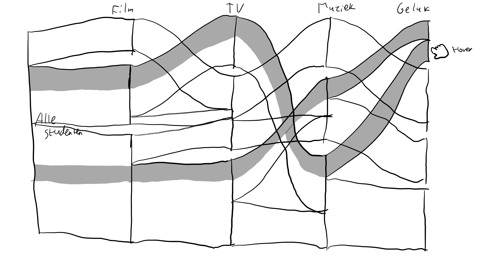

# Eindopdracht

## Hoofdvraag

Welke content kijken en luisteren gelukkigere studenten?

## Deelvragen

* Hoe oud is de content?
* Wat zijn de genres waaronder de content valt?
* Wat is het tevredenheidsniveau, stressniveau en toekomstbeeld van studenten?
* Hoeveel content wordt er tegenwoordig gestreamd?

## Gebruikte variabelen

* Favoriete film
* Favoriete serie
* Favoriete artiest
* Favoriete muziekgenre
* Levenstevredenheid
* Stressniveau
* Cijfer toekomstbeeld

## Eerste schetsen

Voor de eerste schetsen wilde ik kijken naar wat mogelijk is om te doen met de data, en wat ik eruit kan halen of toe kan voegen.

Het belangrijkste wat uit deze schetsen voortkomen is dat er veel variatie mogelijk is in hoe de data kan worden gepresenteerd. Het biedt ook veel opties voor gelaagde interacties, om te filteren tussen de verschillende datasets binnen 1 grafiek. Daarnaast is ook duidelijk te zien dat andere data van buiten deze dataset nog extra context kan bieden voor de data uit de set, dus ik vertrouw erop dat ik die aanvullende data van online kan vinden.

## Feedback vrijdag 2 oktober

Op vrijdag 2 oktober heb ik een feedbacksessie gehad en de schetsen hierboven laten zien. De feedback is eigenlijk in een paar punten simpel samen te vatten:

* Bij sommige grafieken, zoals de beeswarm plot, is het misschien wel vet om nog een as toe te voegen en datapunten als geboortedatum toe te voegen.
* Progressive disclosure is zeker een goede optie. Beginnen met basale visualisatie die met elke stap een stuk ingewikkelder worden is zeker geen verkeerd idee.
* Als er nog tijd over is kan data uit andere datasets zeker leuk zijn om toe te voegen aan de infographic.

Deze feedback verwerk ik in wat meer gerichte schetsen, met interacties erin verwerkt, die ik daarna over ga zetten in een design. Op dat design wil dan dinsdag feedback krijgen, terwijl ik in de tussentijd de basis alvast programmeer.

## De gerichte schetsen met interacties en wireframe

Ik ga als eerste aan de slag met de progressive disclosure feedback. Ik heb het idee om een vette uitvouw bovenaan de pagina te maken, die gedetaileerder wordt naarmate je verder naar beneden scrollt. De uitwerking hiervan zie je hieronder.

De sankey diagram is als volgende aan de beurt. Ik ben ervan overtuigd dat ik deze wil gebruiken zoals ik hem eerder al heb geschetst, dus ga ik alleen de interactie uitwerken.

De volgende twee schetsen die ik wil maken zijn voor de beeswarm en de treemap. Daar is nog wat experimentatie mogelijk, wat je hieronder kan zien.

Ik merk dat ik nog heel wat ideetjes heb voor deze twee, maar wil even kijken hoe het eruit ziet als ik alles bij elkaar zet in een wireframe voor web. Voordat ik dat maak, wil ik nog even kijken hoe ik extra data van streaming diensten er leuk uit zou kunnen laten zien.

Ik heb nu wel een idee hoe ik dit wil aanpakken, dus ga ik een wireframe maken en kijken hoe ik dit op desktop eruit kan laten zien.

Ik ben erg tevreden met de wireframe. De content is nog vrij vaag, maar dat komt omdat ik nog geen conclusies kan trekken op wat de tekst tussen de diagrammen, en wat de diagrammen zelf zullen vertellen. De volgorde van de content ziet er voor mij zo wel logisch uit, dus ga ik het design verder uitwerken in een design programma.

## Programmeerwerk tussendoor

In de tussentijd heb ik alvast wat programmeer- en onderzoekwerk gedaan naar hoe ik dit allemaal interactief kan krijgen, en dat heeft erg geholpen met wat de mogelijkheden zijn met de grafieken. Hierdoor heb ik het zoom-effect op de treemap bijvoorbeeld verworpen, omdat je dat zelf van scratch meot maken en ik daar geen tijd voor heb. Ik ga het zo bouwen dat ik met frameworks die anderen hebben gemaakt alles kan bouwen zoals ik het wil, terwijl de basis al is gelegd door de makers van die frameworks.

## Design

Het stijl voor het uiteindelijke ontwerp is warm met lettertypes die de infographic doen lijken op werken van NYT, TSCP, FT en andere reputabele bladen.

> [Link naar kleurenpalet](https://coolors.co/585123-eec170-f2a65a-f58549-772f1a)

Lettertypes:

* [Libre Baskerville](https://fonts.google.com/specimen/Libre+Baskerville?category=Serif&preview.text=Welke%20content%20kijken%20en%20luisteren%20gelukkigere%20studenten%3F&preview.text_type=custom)
* [Raleway](https://fonts.google.com/specimen/Raleway?category=Sans+Serif&preview.text=Welke%20content%20kijken%20en%20luisteren%20gelukkigere%20studenten%3F&preview.text_type=custom)

### Veranderingen in uiteindelijke design

Ik heb wat kleine dingen veranderd in het ontwerp ten opzichte van de wireframe:

* Play button weggehaald, mensen kunnen best zelf naar beneden scrollen.
* Externe data weggehaald. Ga ik niet redden gezien de deadline al erg snel is.
