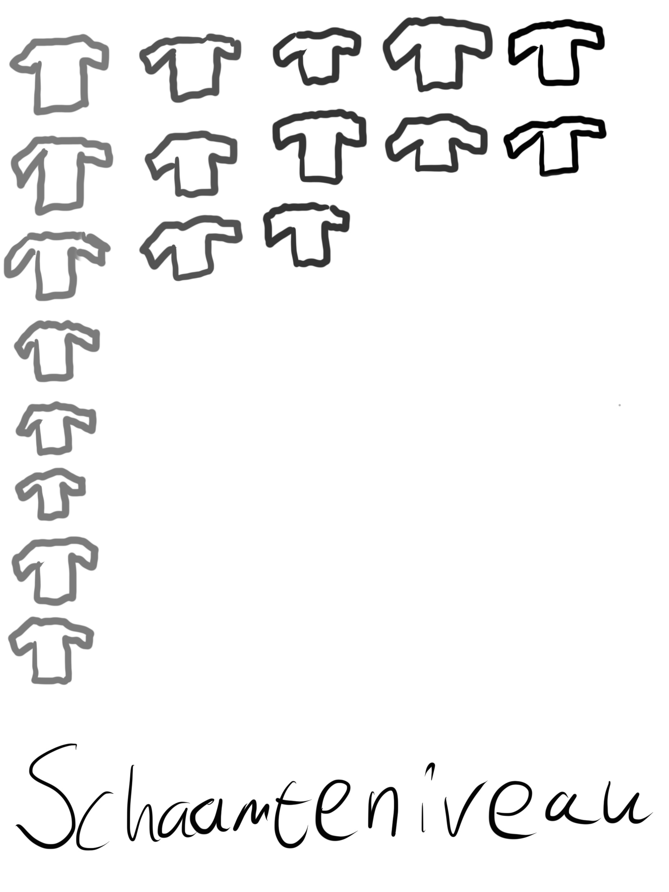

# Encoding en Representation

## Gekozen collectie

De collectie die ik uit heb gekozen is mijn kledingkast.

### Eigenschappen collectie

* Type kledingstuk
* Primaire kleur
* Hoeveelheid kleuren
* Maat
* Hals-soort
* Is het schoon?
* Hoeveelheid gaten
* Schaamteniveau
* Vakje
* Print
* Patroon
* Werkkleding
* Sportkleding
* Nette kleding
* Opgehangen?
* Wegdoen?
* Hoe lang had ik het al weg moeten doen?
* Hoe lang heb ik het al in mijn bezit?

### Foto collectie

De collectie is geordend op basis van schaamteniveau. De schaamteniveau is een ordinale schaal van 1 tot 5, en is beoordeeld op hoe erg ik me zou schamen als ik met het kledingstuk buiten zou rondlopen. 1 is geen schaamte, 5 is doodschaamte.

### Abstrahering

Dit is de abstrahering die ik ervoor had gemaakt voor de feedback sessie van 11 september 2020:

Tijdens de coaching-sessie kreeg ik te horen dat het een letterlijke representatie moest worden. Deze feedback heb ik op deze manier doorgevoerd:

### Ordeningen

Voor de coaching-sessie vrijdag had ik deze ordeningen gemaakt:

De feedback die ik op deze ordeningen kreeg ging voornamelijk in op dat ik de attributen die ik gebruik niet te letterlijk moet nemen, en dat ik de ordeningen dus abstracter moet maken.

Dit zijn de ordeningen die ik heb gemaakt op basis van die feedback:

