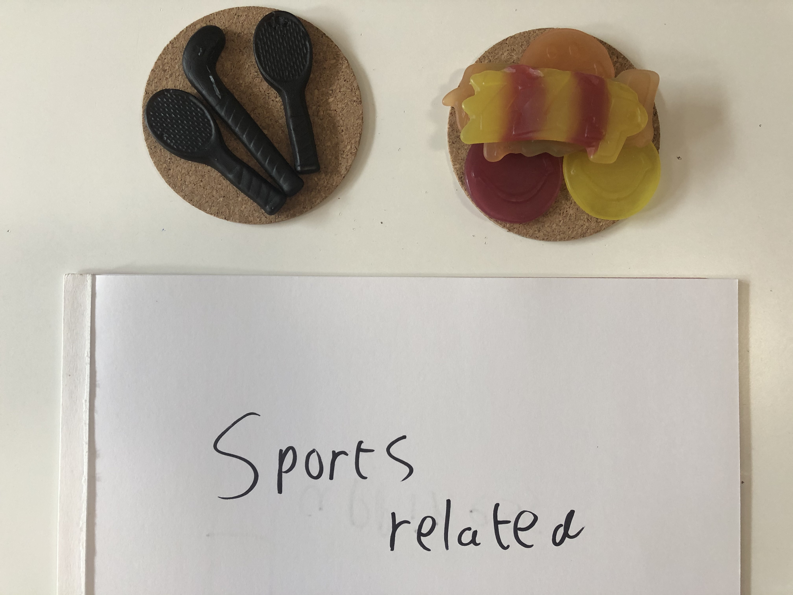

# Snoepgoed

Tijdens de eerste les van Datavisualisatie 2 hebben we geprobeerd een zak snoepgoed te ordenen op verschillende manieren. Ik heb met een zak grote Red Band sneop dit voor elkaar gekregen.

## Foto's

## Visualisaties

