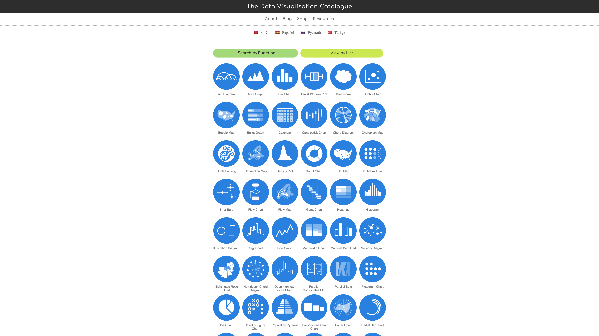

# Week 1: Zachte en harde datavisualisaties

In de eerste week van het project maken we een datawalk. Tijdens deze walk kijken we naar bepaalde objecten in de omgeving en maken we aantekeningen op basis van 5 variabelen die we zelf uit hebben gekozen. Rosa Voogd en ik doen deze datawalk samen, en gaan kijken naar zitbanken in de omgeving. Van onze opvattingen gaan we een zachte en harde datavisualisatie maken. Wat dat precies inhoudt, leren we deze week.

## Data walk

## Hoorcollege, dinsdag 1 september

### Yordi Dam: Harde datavisualisaties

Met datavisualisatie kan je verhalen vertellen die met tekst moeilijk te vertellen zijn. Yordi doet dit in Localfocus; een datavisualisatietool gemaakt door Yordi en zijn vrienden.

#### extragratistips

1. Stel 1 goede vraag om je data te kunnen visualiseren. Zorg ervoor dat deze erg gericht is. Less = more.
2. Denk aan je publiek. Complexe of artistieke visuals maken kan uiteraard wel, maar niet voor een algemeen publiek.
3. Plain & Simple kaartendata is het best.
4. Noem niet teveel getallen in de tekst, rond ze af of maak ze menselijk.
5. Zoek naar de juiste verhouding tussen eye-candy en brain-candy. Wat is noodzakelijk en wat is mooi/illustratief.
6. Breidt je visuele vocabulaire uit door veel visuals te bekijken en te analyseren. Welke designafwegingen zijn gemaakt en waarom?

Waarom visualiseren?

* Patronen, trends en uitschieters worden zichtbaar
* Het helpt bij het analyseren van data
* Met een visualisatie krijg je een veel beter beeld over wat de data je vertelt, en wat jij met de data kan vertellen.

De Y-as afbreken is 99% van de tijd niet nodig, dus niet doen als het niet nodig is.

Nog wat referenties van Yordi

> [https://www.datavizcatalogue.com](https://www.datavizcatalogue.com)

> Financial Times visual vocabulary

### Jan Rothuizen: Zachte datavisualisaties

Met zachte visualisaties sta je stil bij hoe jij je omgeving interpreteert. Het is subjectief en daardoor niet waarheidsgetrouw.

Je noteert gebeurtenissen, sfeerimpressies, interacties en alles wat jou opvalt aan jouw omgeving. Wat je doet, denkt, en vindt van je omgeving. Je brengt dit in kaart door schetsen en teksten zo neer te zetten dat het op een kaart begint te lijken. Het geeft context aan alles wat je vastlegt.

Als je het verhaal achter een foto of tekening vertelt, krijgt het gelijk een emotionele lading. Dit kan de kijker een grotere impressie geven.

Tijdens de data walk is het belangrijk om gebeurtenissen en sferen vast te leggen, zodat Rosa en ik ook een zachte visualisatie kunnen maken voor onze wandeling, naast alles wat we vast hebben gelegd voor onze harde visualisatie.
