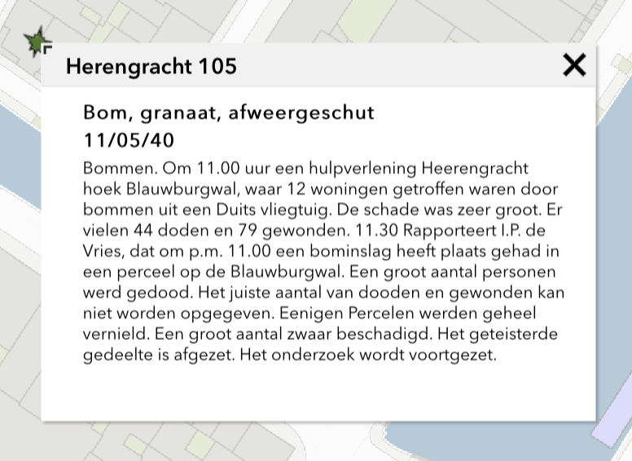
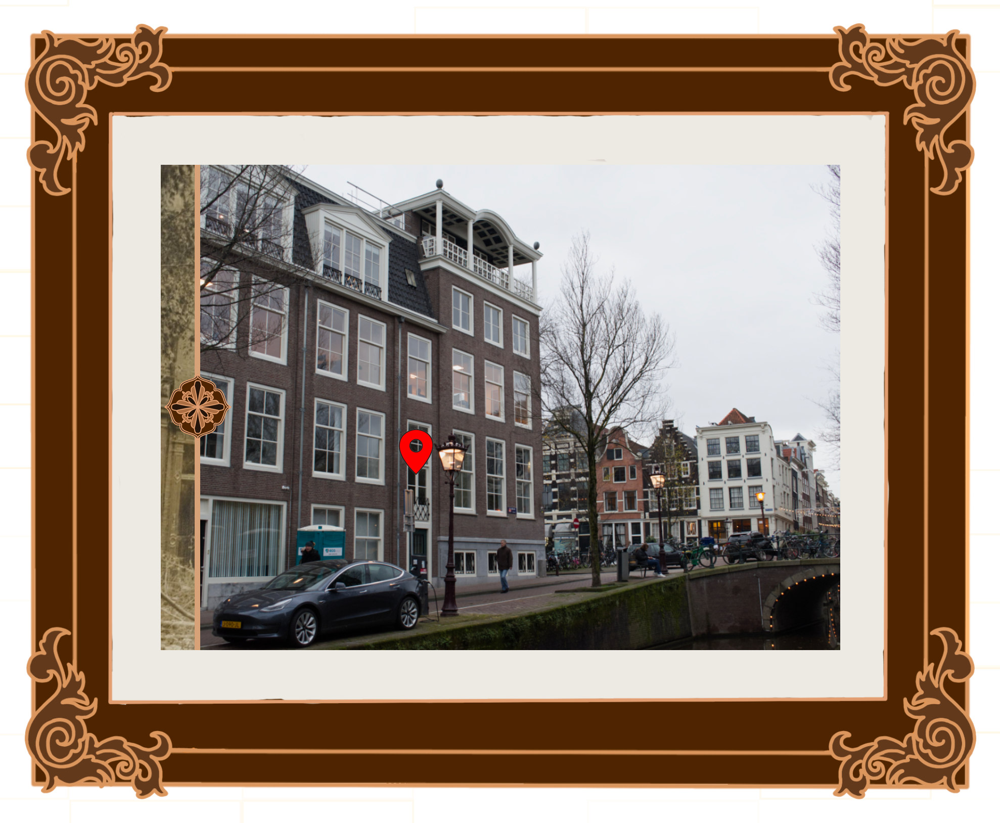

# Dataweek

In de dataweek ben ik met Rosa Voogd aan de slag gegaan met een unieke fotovisualisatie waarbij een bomaanslag letterlijk en figuurlijk wordt blootgesteld. Een bomaanslag waar je normaliter eigenlijk nooit wat over hoort. De bomaanslag op de Blauwburgwal.

Voordat we op dit concept zijn gekomen, zijn we eerst gaan brainstormen over wat ideetjes die misschien leuk zouden zijn.

## Brainstorm

Rosa had al een leuk idee voor een puzzel, maar wist nog niet zeker welke data ze wilde gebruiken voor het maken van de puzzel. Ze ging kijken naar de kaart-data die Amsterdam aanbiedt, en bleef al snel hangen op bomen. Een puzzel waarbij je bomen als puzzelstukjes gebruikt was een goed idee, maar we bleven nog even doorgaan met brainstormen.

We kwamen op het idee om data over bomaanslagen tijdens WOII te gebruiken voor een idee, maar liepen al snel vast bij het feit dat we zelf een dataset moeten maken d.m.v. observaties. We wisten niet echt hoe we dit goed voor elkaar konden krijgen, dus hebben we ervoor gekozen om terug te gaan naar bomen. Ik kwam toen met het zeer volwassen idee om te gaan observeren tegen welke bomen honden het meeste plassen.

Dat was misschien niet de slimste zet, want volgens de rubric moet het een datavisualisatie zijn die best serieus is. Terug naar bommen dus, en naar Ruiter Jansen met de vraag wat we hierop het beste kunnen toevoegen qua eigen dataset.

## Feedback Ruiter Jansen

Ruiter Jansen heeft ons veel goede ideeën gegeven. We zijn even gaan brainstormen over wat voor concepten hierover uitgewerkt kunnen worden, en kwamen uiteindelijk op het uitgangspunt dat:

1. Het klein moest blijven.
2. Er met een focus op het verhaal van een bombardement veel gedaan kon worden.
3. Doe iets met de locatie van de aanslag, zoals krijttekeningen van de inslag of iets met foto's.

Hiernaast brainstormden we ook al wat ideetjes, maar daar hebben we eigenlijk niets mee gedaan verder. Naast dat we een foto hebben gemaakt, maar daarover hieronder meer.

## Onderzoek

We gingen op onderzoek uit naar een interessante bomaanslag. Ik had zelf een Vormgeving 2 herkansing, dus dit werk heb ik aan Rosa overgelaten. Zij kwam al snel op de Herengracht 105 uit, waar onwijs veel informatie over te vinden was.

> Screenshot van https://maps.amsterdam.nl

Na wat verder onderzoek gedaan te hebben naar de case kwamen we erachter dat er een speciale herdenking was voor deze aanslag in mei van dit jaar. Er is een plakkaat opgehangen met alle namen van degenen die de aanslag niet hebben overleefd.

Daarnaast is er ook een boek geschreven over de verhalen van degenen die direct betrokken waren bij de aanslag. De verhalen van ooggetuigen, gewonden, zwaargewonden en overledenen zijn verzameld en het boek "In Memoriam de Blauwburgwal" erover geschreven, onder andere.

Ik ben achter het achterhalen van het e-mailadres van de heer Geukes Foppen aan gegaan. Door contact te zoeken met de uitgeverij van het boek, kon ik binnen een dag het e-mailadres krijgen van de schrijver, waarbij hij ook persoonlijk een mail stuurde en ons een hart onder de riem stook. 

Het stadsarchief bleek, naast dit boek, ook foto's te bezitten over de bomaanslag. Deze bronnen hebben we allemaal gebruikt om ons concept zo compleet, maar ook simpel mogelijk te houden.

## Concept

Het concept waar Rosa en ik op zijn gekomen is een fotoframe, waarin we een foto van nu, en een foto na de aanslag bovenop elkaar leggen. Tussen de foto's kan gewisseld worden d.m.v. een before/after slider. Met zo'n slider zie je normaliter het verschil voor en na een gebeurtenis met 2 verschillende foto's. Denk aan iets heel basaals als een bepaalde filter die is toegepast. Dit wilde we naar het volgende niveau brengen door de bomaanslag als before te gebruiken, en de huidige stand van zaken als de after.

Op woensdag zijn we het boekje van Geukes Foppen gaan halen, zijn daarna het concept gaan bespreken in de medialounge en hebben daarna foto's gemaakt van de Blauwburgwal. We zagen eigenlijk gelijk wel al dat de wal vrijwel geen charme had, en er best verlaten bij stond. Een groot contrast met de foto's die we online zagen van voor de bomaanslag.

Op donderdag hebben we de hele dag thuisgewerkt, en het concept in principe in zijn geheel uitgewerkt. Ik heb hierbij alles zelf geprogrammeerd. Ik gebruikte een framework genaamd [Svelte](https://svelte.dev), wat het ontwikkelproces een heel stuk versnelde, en heb verder _bijna_ alles zelf geprogrammeerd. Het subtiele achtergrond-effect heb ik gemaakt met een tool die [css-doodle](https://css-doodle.com) heet. Ik raad het erg aan als je technisch aangelegd bent en je wat tijd over hebt!

De reden waarom ik dit zelf heb geprogrammeerd, en niet heb gekeken naar andere oplossingen, is omdat ik de basis functionaliteit in 2 uur al af had, en de rest van de layout en alles met een extra 8 uur. Gezien we niet zoveel tijd hadden, was deze intense time-save dus van groot belang voor Rosa en ik.

[Bekijk hier het concept](https://dataweek.jonahgold.dev)

## Conclusie

Na de bomaanslag is de wal nooit meer geweest wat het ooit was. Het gebouw dat Blauwburgwal 19, 21, 23 en 25 verving huist nu alleen nog maar nummer 19, en heeft lang niet dezelfde gezellige uitstraling als de herenhuizen die platgebombardeerd zijn. De gruwelijke gebeurtenis heeft de wal permanent bestempeld, waar nu gelukkig veel meer over te vinden is.

Fred vond het concept indrukwekkend en leuk, waarbij hij nog wel vertelde dat er veel potentie in zit om verder uit te werken met meer foto's.
