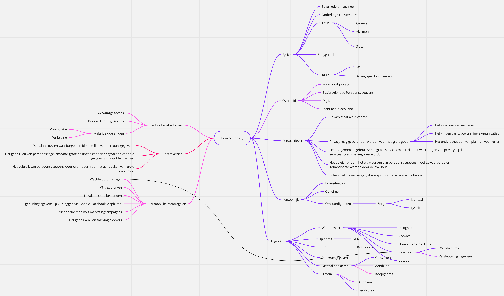
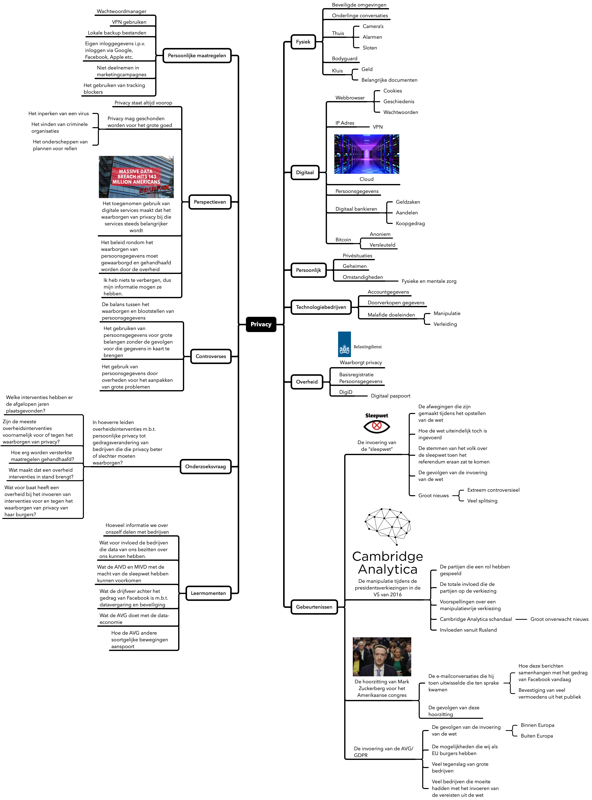
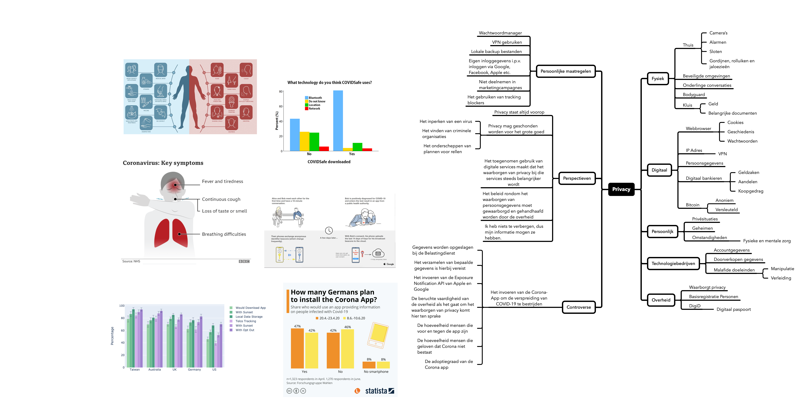

# Datavisualisatie 1

## Toets 1

Toets 1 gaat over het vergaren van informatie over een bepaald onderwerp. Dat onderwerp spit je eerst door d.m.v. alle aspecten in een mindmap te zetten. Je gaat dieper in op de verschillende aspecten, en probeert zo punten te vinden die je kan tackelen met een simpele onderzoeksvraag.

Voor Toets 1 heb ik het onderwerp "Privacy" gekregen. Dit onderwerp heb ik doorgewerkt en deze mindmap hieronder:

Op deze mindmap kreeg ik de feedback om verder in te gaan op de "controverses", waar ik dit onder verstond:

### De zoektocht

| Zoekvraag          |                                                                                                                                                  |
| :----------------- | :----------------------------------------------------------------------------------------------------------------------------------------------- |
| Probleem/Onderwerp | Overheidsinterventies met betrekking tot privacy, en wat dat allemaal met zich meebrengt.                                                        |
| Zoekvraag          | In hoeverre leiden overheidsinterventies die moeten leiden tot betere of slechtere waarborging van privacy tot gedragsverandering van bedrijven? |

| Vraagelement 1                                 | Vraagelement 2                                            | Vraagelement 3             | Vraagelement 4                   | Vraagelement 5                                    |
| :--------------------------------------------- | :-------------------------------------------------------- | :------------------------- | :------------------------------- | :------------------------------------------------ |
| Overheidsinterventies                          | Gedragsverandering                                        | Bedrijven                  | Privacy                          | Waarborging                                       |
| **Synoniemen**                                 | **Synoniemen**                                            | **Synoniemen**             | **Synoniemen**                   | **Synoniemen**                                    |
| Wetgeving, hoorzittingen, handhaving, sluiting | Overgave, overgeven, onderdoor gaan, onderwerpen, meegaan | Ondernemingen, corporaties | Geheimhouding, bewegingsvrijheid | Garanderen, verzekeren, beschermen, zeker stellen |

| Gebruikte bronnen | Gebruikte zoektermen + operatoren                                                                                                   | Gevonden referentie                                                                                                                                                                                                                                                                                                                                                                                                                                                 | Datum            |     |
| :---------------- | :---------------------------------------------------------------------------------------------------------------------------------- | :------------------------------------------------------------------------------------------------------------------------------------------------------------------------------------------------------------------------------------------------------------------------------------------------------------------------------------------------------------------------------------------------------------------------------------------------------------------ | :--------------- | :-- |
| NexisUni          | privacy and law or wetgeving, na 1 januari 2015 in het Nederlands                                                                   | [Broekhuizen, K. \(2018, 19 april\). Wetgeving voor privacy onvermijdelijk na twee hoorzittingen. het Financieel Dagblad, 14.](https://advance-lexis-com.rps.hva.nl:2443/document/?pdmfid=1516831&crid=0c054595-64ea-4878-afb1-61f0c9dc0bd6&pddocfullpath=%2Fshared%2Fdocument%2Fnews%2Furn%3AcontentItem%3A5S33-JCV1-JCD9-24HJ-00000-00&pdcontentcomponentid=208267&pdteaserkey=sr4&pditab=allpods&ecomp=tzg2k&earg=sr4&prid=7f5e6409-9379-49b1-a9fd-74de8c42f349) | 7 september 2020 |     |
|                   | '', gesorteerd op oud -&gt; nieuw                                                                                                   | [Dagblad van het Noorden. \(2015, 6 januari\). Inzage terroristenlijst mag. Dagblad van het Noorden, 8.](https://advance-lexis-com.rps.hva.nl:2443/document/?pdmfid=1516831&crid=020d836f-89e5-41a8-b981-921ddb082c35&pddocfullpath=%2Fshared%2Fdocument%2Fnews%2Furn%3AcontentItem%3A5F0X-WDV1-DYRY-N1PT-00000-00&pdcontentcomponentid=277856&pdteaserkey=sr2&pditab=allpods&ecomp=tzg2k&earg=sr2&prid=1ee42038-59bf-4b8e-8a5a-1b133a0122ea)                       | 8 september 2020 |     |
|                   | ''                                                                                                                                  | [Ferdinandusse, W. \(2015, 15 januari\). Charlie Hebdo toont belang bewaarplicht telecomgegevens. NRC Handelsblad, 9.](https://advance-lexis-com.rps.hva.nl:2443/document/?pdmfid=1516831&crid=e0e09090-425c-4c98-bba5-2c2f916c8c81&pddocfullpath=%2Fshared%2Fdocument%2Fnews%2Furn%3AcontentItem%3A5F2W-TN51-DYRY-N195-00000-00&pdcontentcomponentid=259064&pdteaserkey=sr4&pditab=allpods&ecomp=tzg2k&earg=sr4&prid=5267b370-55d0-4573-94df-8d786d127c10)         |                  |     |
|                   | privacy and waarborgen or waarborgin or garanderen, na 1 januari 2018, bronnen het NRC, het FD en de Volkskrant kranten en websites | [de Ruiter, M. \(2020, 25 augustus\). Horecaondernemers moeten persoonsgegevens registreren en bewaren, maar aan privacy is niet gedacht. de Volkskrant.](https://www.volkskrant.nl/nieuws-achtergrond/horecaondernemers-moeten-persoonsgegevens-registreren-en-bewaren-maar-aan-privacy-is-niet-gedacht~b287337c/)                                                                                                                                                 |                  |     |

#### Zoekgeschiedenis

- NexisUni
  - privacy and law or wetgeving, na 1 januari 2015 in het Nederlands
  - privacy and law or wetgeving, na 1 januari 2015 in het Nederlands, gesorteerd van oud -&gt; nieuw
  - privacy and waarborgen or waarborgin or garanderen, na 1 januari 2018, bronnen het NRC, het FD en de Volkskrant kranten en websites
- Google
  - privacy waarborgen
  - privacy ensure data filetype:pdf
  - privacy data filetype:pdf
  - privacy dataset filetype:pdf
  - privacy dataset filetype:csv
  - "government" privacy behaviour filetype:csv
  - "government" privacy company filetype:csv
  - "government" privacy and company filetype:csv
  - "government" privacy filetype:csv
  - government "privacy" filetype:csv
  - "privacy" government filetype:csv
  - "privacy" government filetype:xlsx
  - "privacy" legislation effect filetype:csv
  - "privacy legislation" effect filetype:csv
  - "privacy legislation" filetype:csv
  - privacy legislation filetype:csv
  - privacy handhaving filetype:csv

### Regroup

Nu ik dit heb gedocumenteerd ben ik erachter gekomen dat het onderwerp wat ik heb uitgekozen helemaal niet de resultaten biedt die ik verwachtte. Het wordt dus tijd om terug te gaan naar de tekentafel en de mindmap opnieuw uit te werken. Ik heb veel overbodige knopen uit de mindmap gehaald, en me gefocust op iets wat _erg_ recentelijk is: Het coronavirus en de app die voor het bron- en contactonderzoek wordt ontwikkeld. Door deze wending is de mindmap uiteindelijk er zo uit te komen zien:

Mijn nieuwe controverse is dus het coronavirus en de app die de Nederlandse overheid wilt inzetten om dit virus te bestrijden. Mijn onderzoeksvraag hiervoor luidt: Hoeveel vertrouwen en enthousiasme heeft het volk in CoronaMelder, nu het in bepaalde regio's al wordt ingezet en resultaten oplevert?

### De zoektocht V2

| Zoekvraag          |                                                                                                                                        |
| :----------------- | :------------------------------------------------------------------------------------------------------------------------------------- |
| Probleem/Onderwerp | De Corona-app en de gedachten van het volk bij deze app.                                                                               |
| Zoekvraag          | Hoeveel vertrouwen en enthousiasme heeft het volk in CoronaMelder, nu het in bepaalde regio's al wordt ingezet en resultaten oplevert? |

| Vraagelement 1 | Vraagelement 2                            | Vraagelement 3 | Vraagelement 4                                                    | Vraagelement 5                 |
| :------------- | :---------------------------------------- | :------------- | :---------------------------------------------------------------- | :----------------------------- |
| Vertrouwen     | Enthousiasme                              | CoronaMelder   | Resultaten                                                        | Ingezet                        |
| **Synoniemen** | **Synoniemen**                            | **Synoniemen** | **Synoniemen**                                                    | **Synoniemen**                 |
| Geloven, hopen | IJver, animo, toewijding, gloed, aandacht | Corona-app,    | Uitkomst, uitslag, voortvloeisel, opbrengst, conclusie, rendement | Aanbieden, gebruiken, intreden |

| Gebruikte bronnen | Gebruikte zoektermen + operatoren                                                   | Gevonden referentie                                                                                                                                                                                                                                                                                                                                                        | Datum            |
| :---------------- | :---------------------------------------------------------------------------------- | :------------------------------------------------------------------------------------------------------------------------------------------------------------------------------------------------------------------------------------------------------------------------------------------------------------------------------------------------------------------------- | :--------------- |
| Nexis Uni         | corona-app or coronamelder and vertrouwen or geloven or hopen, vanaf 1 januari 2020 | [Bahara, H. \(2020, 20 april\). Appathon bedolven onder kritiek. de Volkskrant, 3.](https://advance-lexis-com.rps.hva.nl:2443/r/documentprovider/x5hvk/attachment/data?attachmentid=V1,215,27667,003NLV1QU20200421VKN0100,1&attachmenttype=PDF&attachmentname=pagina%203&origination=&sequencenumber=&ishotdoc=false&docTitle=&pdmfid=1516831&#page=)                      | 9 september 2020 |
| Nexis Uni         | corona-app and vertrouwen vanaf 1 januari 2020                                      | [Vader, A. \(2020, 20 augustus\). Polarisatie over aanpak corona groeit. Reformatorisch Dagblad, 1.](https://advance-lexis-com.rps.hva.nl:2443/r/documentprovider/x5hvk/attachment/data?attachmentid=V1,215,37763,20200820001DKRMAINVPG,1&attachmenttype=PDF&attachmentname=Link%20naar%20PDF&origination=&sequencenumber=&ishotdoc=false&docTitle=&pdmfid=1516831&#page=) | 9 september 2020 |
| Google            | corona onderzoek "vertrouwen" site:ad.nl                                            | [van Mersbergen, S. \(2020, 20 augustus\). Onvrede over coronabeleid groeit: Nederland ernstig verdeeld. AD.](https://www.ad.nl/binnenland/onvrede-over-coronabeleid-groeit-nederland-ernstig-verdeeld~a84342bb)                                                                                                                                                           | 9 september 2020 |
| Google            | corona app "vertrouwen"                                                             | [Helft van Nederlanders vertrouwt corona-app van de overheid niet. \(2020, 17 augustus\). Hart van Nederland.](https://www.hartvannederland.nl/nieuws/2020/wat-vindt-nederland-vertrouwen-corona-app/)                                                                                                                                                                     | 9 september 2020 |
| Google            | corona-app or coronamelder onderzoek vertrouwen OR geloven OR animo                 | [RIVM. \(2020, 7 september\). Communicatie en vertrouwen. RIVM.](https://www.rivm.nl/gedragsonderzoek/maatregelen-welbevinden/communicatie-en-vertrouwen)                                                                                                                                                                                                                  | 9 september 2020 |
| Google Scholar    | corona app privacy vertrouwen                                                       | [Bente, B., van ’t Klooster, J. W., Slijkhuis, P., Berkemeier, L., Schreijer, M., van Gend, J., Kelders, S., & van Gemert-Pijnen, L. \(2020, juli\). Eindrapportage Gebruikerstesten Corona Notificatie app \(Regio Twente\).](https://ris.utwente.nl/ws/portalfiles/portal/219247645/Eindrapportage_gebruikerstesten_van_de_coronavirus_notificatie_app.pdf)              | 9 september 2020 |
| Google Scholar    | corona app vertrouwen OR animo OR IJver                                             | [Mouter, N., Kessels, R., de Wit, A., Rotteveel, A., & Lambooij, M. \(2020\). Grote verdeeldheid over wenselijkheid van de corona-app. TU Delft.](https://repository.tudelft.nl/islandora/object/uuid:1a0fe1b2-954f-4a2c-8a69-5c87e9f7e6ed?collection=research)                                                                                                            | 9 september 2020 |
| Google Scholar    | corona-app resultaten "gebruik"                                                     | [Verbeek, P. P. C. C., Brey, P., van Est, R., van Gemert, L., Heldeweg, M., & Moerel, L. \(2020, juli\). Ethische analyse van de COVID-19 notificatie-app ter aanvulling op bron en contactonderzoek GGD.](https://repository.overheid.nl/frbr/plooi-contentbeheer/rijksoverheid/2020/plooicb-2020-2908/1/pdf/plooicb-2020-2908.pdf)                                       | 9 september 2020 |
| Google Scholar    | corona-app resultaten "gebruik"                                                     | [van Hoogstraten, R. R., Veth, I., & Bakker, S. \(2020, juni\). Veiligheid boven vrijheid? Een interdisciplinair onderzoek naar verklaringen voor de publieke naleving van coronamaatregelen in Nederland.](https://dspace.library.uu.nl/handle/1874/398270)                                                                                                               | 9 september 2020 |
| Google Scholar    | corona-app privacy                                                                  | [Hof, J. \(2020, april\). Kan het gebruik van een corona-app worden verplicht?](https://research.hanze.nl/en/publications/kan-het-gebruik-van-een-corona-app-worden-verplicht)                                                                                                                                                                                             | 9 september 2020 |

| Gebruikte bronnen     | Gebruikte zoektermen + operatoren | Gevonden dataset                                                                                                                                                                                                               | Datum             |
| --------------------- | --------------------------------- | ------------------------------------------------------------------------------------------------------------------------------------------------------------------------------------------------------------------------------ | ----------------- |
| Google Dataset Search | coronavirus opinions netherlands  | [EenVandaag. (032020). Netherlands: views on governmental prevention of coronavirus 2020 [Dataset]. EenVandaag.](https://www.statista.com/statistics/1102064/government-action-to-prevent-coronavirus-concern-in-netherlands/) | 10 september 2020 |

| Google Dataset Search | corona app | [BMG & Robert Koch-Institut. (2020, september). Coronavirus (COVID-19) tracing app downloads Germany 2020 [Dataset]. Robert Koch-Institut; ZDF.](https://www.statista.com/statistics/1127547/coronavirus-covid-19-tracing-app-downloads-by-os-germany/) | 10 september 2020 |
| Google Dataset Search | | [YouGov & Imperial College London. (2020, juli). Masks in Europe 2020 [Dataset]. Imperial College London.](https://www.statista.com/statistics/1114375/wearing-a-face-mask-outside-in-european-countries/) | 10 september 2020 |

#### Zoekgeschiedenis V2

Zoektermen op chronologische volgorder:

- Nexis Uni
  - corona-app OR coronamelder AND vertrouwen OR geloven OR hopen
    Gefilterd op verschillende publicaties (volkskrant, fd en nrc) met resultaten vanaf 1 januari 2020
  - corona-app AND vertrouwen
- Google
  - corona onderzoek ad
  - corona onderzoek site:ad.nl
  - Markteffect
  - corona onderzoek "vertrouwen" site:ad.nl
  - onderzoek "corona" site:markteffect.nl
  - onderzoek corona site:markteffect.nl
  - onderzoek "corona"
  - corona-app OR coronamelder onderzoek vertrouwen OR geloven OR animo
- Google Scholar
  - corona app privacy vertrouwen
  - corona app vertrouwen OR animo OR ijver
  - coronamelder privacy "vertrouwen"
  - coronamelder privacy
  - corona-app resultaten "gebruik"
  - corona app "hoop" OR "vertrouwen"
  - corona app (hoop OR vertrouwen)
  - corona app vertrouwen volk
  - corona app resultaten "vertrouwen publiek"
  - corona app resultaten "vertrouwen"
  - corona app uitslag OR gebruiken
  - corona uitslag OR gebruiken
  - corona-app uitslag OR gebruiken
  - corona-app vertrouwen
  - corona-app trust
  - corona-app privacy
- Google Dataset Search
  - coronavirus app netherlands
  - coronavirus opinions netherlands
  - corona app (opinions OR trust OR privacy) netherlands
  - (corona smartphone app) OR coronamelder netherlands
