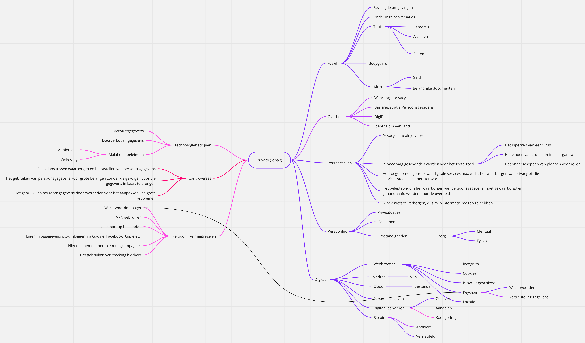

# Datavisualisatie 1

## Toets 1

Toets 1 gaat over het vergaren van informatie over een bepaald onderwerp. Dat onderwerp spit je eerst door d.m.v. alle aspecten in een mindmap te zetten. Je gaat dieper in op de verschillende aspecten, en probeert zo punten te vinden die je kan tackelen met een simpele onderzoeksvraag.

Voor Toets 1 heb ik het onderwerp "Privacy" gekregen. Dit onderwerp heb ik doorgewerkt en deze mindmap hieronder:

### De zoektocht

| Zoekvraag          |                                                                                                                                                  |
| ------------------ | ------------------------------------------------------------------------------------------------------------------------------------------------ |
| Probleem/Onderwerp | Overheidsinterventies met betrekking tot privacy, en wat dat allemaal met zich meebrengt.                                                        |
| Zoekvraag          | In hoeverre leiden overheidsinterventies die moeten leiden tot betere of slechtere waarborging van privacy tot gedragsverandering van bedrijven? |

| Vraagelement 1                                 | Vraagelement 2                                            | Vraagelement 3             | Vraagelement 4                   | Vraagelement 5                                    |
| ---------------------------------------------- | --------------------------------------------------------- | -------------------------- | -------------------------------- | ------------------------------------------------- |
| Overheidsinterventies                          | Gedragsverandering                                        | Bedrijven                  | Privacy                          | Waarborging                                       |
| **Synoniemen**                                 | **Synoniemen**                                            | **Synoniemen**             | **Synoniemen**                   | **Synoniemen**                                    |
| Wetgeving, hoorzittingen, handhaving, sluiting | Overgave, overgeven, onderdoor gaan, onderwerpen, meegaan | Ondernemingen, corporaties | Geheimhouding, bewegingsvrijheid | Garanderen, verzekeren, beschermen, zeker stellen |

| Gebruikte bronnen | Gebruikte zoektermen + operatoren                                                                                                   | Gevonden referentie                                                                                                                                                                                                                                                                                                                                                                                                                                               | Datum            |
| ----------------- | ----------------------------------------------------------------------------------------------------------------------------------- | ----------------------------------------------------------------------------------------------------------------------------------------------------------------------------------------------------------------------------------------------------------------------------------------------------------------------------------------------------------------------------------------------------------------------------------------------------------------- | ---------------- |
| NexisUni          | privacy and law or wetgeving, na 1 januari 2015 in het Nederlands                                                                   | [Broekhuizen, K. (2018, 19 april). Wetgeving voor privacy onvermijdelijk na twee hoorzittingen. het Financieel Dagblad, 14.](https://advance-lexis-com.rps.hva.nl:2443/document/?pdmfid=1516831&crid=0c054595-64ea-4878-afb1-61f0c9dc0bd6&pddocfullpath=%2Fshared%2Fdocument%2Fnews%2Furn%3AcontentItem%3A5S33-JCV1-JCD9-24HJ-00000-00&pdcontentcomponentid=208267&pdteaserkey=sr4&pditab=allpods&ecomp=tzg2k&earg=sr4&prid=7f5e6409-9379-49b1-a9fd-74de8c42f349) | 7 september 2020 |
|                   | '', gesorteerd op oud -> nieuw                                                                                                      | [Dagblad van het Noorden. (2015, 6 januari). Inzage terroristenlijst mag. Dagblad van het Noorden, 8.](https://advance-lexis-com.rps.hva.nl:2443/document/?pdmfid=1516831&crid=020d836f-89e5-41a8-b981-921ddb082c35&pddocfullpath=%2Fshared%2Fdocument%2Fnews%2Furn%3AcontentItem%3A5F0X-WDV1-DYRY-N1PT-00000-00&pdcontentcomponentid=277856&pdteaserkey=sr2&pditab=allpods&ecomp=tzg2k&earg=sr2&prid=1ee42038-59bf-4b8e-8a5a-1b133a0122ea)                       | 8 september 2020 |
|                   | ''                                                                                                                                  | [Ferdinandusse, W. (2015, 15 januari). Charlie Hebdo toont belang bewaarplicht telecomgegevens. NRC Handelsblad, 9.](https://advance-lexis-com.rps.hva.nl:2443/document/?pdmfid=1516831&crid=e0e09090-425c-4c98-bba5-2c2f916c8c81&pddocfullpath=%2Fshared%2Fdocument%2Fnews%2Furn%3AcontentItem%3A5F2W-TN51-DYRY-N195-00000-00&pdcontentcomponentid=259064&pdteaserkey=sr4&pditab=allpods&ecomp=tzg2k&earg=sr4&prid=5267b370-55d0-4573-94df-8d786d127c10)         |                  |
|                   | privacy and waarborgen or waarborgin or garanderen, na 1 januari 2018, bronnen het NRC, het FD en de Volkskrant kranten en websites | [de Ruiter, M. (2020, 25 augustus). Horecaondernemers moeten persoonsgegevens registreren en bewaren, maar aan privacy is niet gedacht. de Volkskrant.](https://www.volkskrant.nl/nieuws-achtergrond/horecaondernemers-moeten-persoonsgegevens-registreren-en-bewaren-maar-aan-privacy-is-niet-gedacht~b287337c/)                                                                                                                                                 |                  |  |

#### Zoekgeschiedenis

- NexisUni
  - privacy and law or wetgeving, na 1 januari 2015 in het Nederlands
  - privacy and law or wetgeving, na 1 januari 2015 in het Nederlands, gesorteerd van oud -> nieuw
  - privacy and waarborgen or waarborgin or garanderen, na 1 januari 2018, bronnen het NRC, het FD en de Volkskrant kranten en websites
- Google
  - privacy waarborgen
  - privacy ensure data filetype:pdf
  - privacy data filetype:pdf
  - privacy dataset filetype:pdf
  - privacy dataset filetype:csv
  - "government" privacy behaviour filetype:csv
  - "government" privacy company filetype:csv
  - "government" privacy and company filetype:csv
  - "government" privacy filetype:csv
  - government "privacy" filetype:csv
  - "privacy" government filetype:csv
  - "privacy" government filetype:xlsx
  - "privacy" legislation effect filetype:csv
  - "privacy legislation" effect filetype:csv
  - "privacy legislation" filetype:csv
  - privacy legislation filetype:csv
  - privacy handhaving filetype:csv
